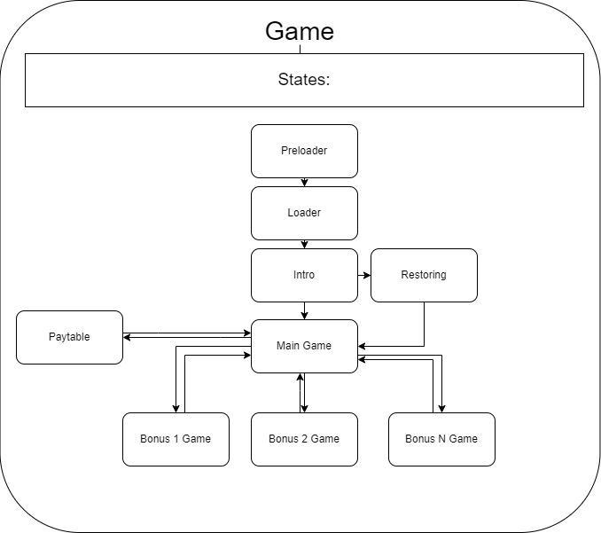
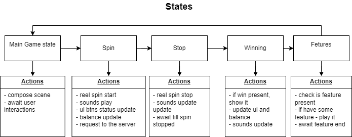

# State Machine & State

### State Machine

State Machine could manage states.
The main goal is to provide ability change one state on some other.



to create state manage just type somewhere:

```typescript
import StateMachine from "./StateMachine";

const stateMachine = new StateMachine();
```

### State Machine competition:

- activation 
- deactivation
- running
- storing and disposing

When state machine already exists, just add to it needed you state: 
```typescript
stateMachine.add('MainState', new MainState());
```

Then you will be able to run it:
```typescript
await stateMachine.goto('MainState');
```
### Sates: 

Main competition is to run something to the active scene.

Example of state for some of the game:


to create state need to create class which should implement State:

```typescript
import MainGameScene from "./MainGameScene";

export default class MainState extends State {
    protected readonly sceneManager = Main.MAIN.mainSceneManager;

    async run(): Promise<this> {
        await sceneManager.navigate(MainGameScene);
        await gamesignals.spin.interation.promise().race();
        await this.goto('nextState');
        return this;
    }
}
```
